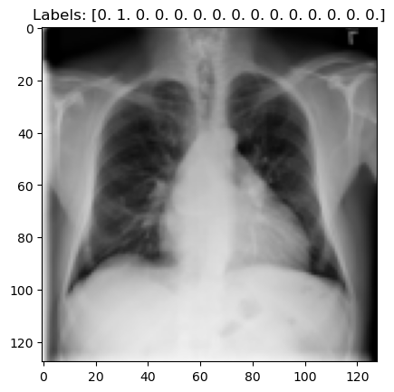
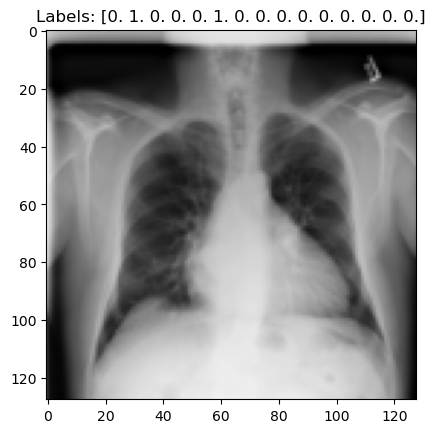
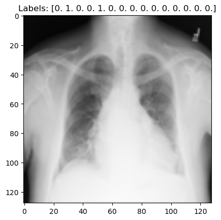
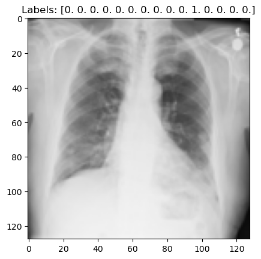
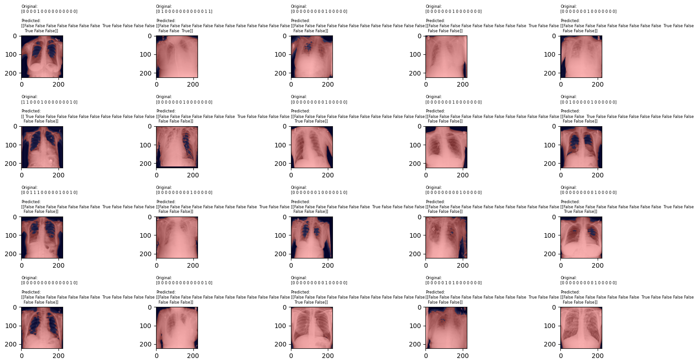

# Multi-Label Medical Image Classification with MetaTeacher

## Project Overview
This project, helmed by Sukhmani Sandhu, Arpita Jadhav, and Saurabh Rajput, presents a groundbreaking approach to multi-label medical image classification. Leveraging the NIH-CXR14 dataset, our model, MetaTeacher, demonstrates exceptional prowess in interpreting complex chest X-ray images. This work stands at the forefront of marrying deep learning with medical image analysis, opening new avenues in diagnostic methodologies.

## Team Contributions
- **Sukhmani Sandhu**
- **Arpita Jadhav**
- **Saurabh Rajput**

## Methodology
Our strategy was comprehensive and data-centric, involving:
- **Data Preparation:** Extensive processing of the NIH-CXR14 dataset, involving cleaning and annotating a diverse set of chest X-ray images.
- 

  
  
  
  

- **Model Development:** Building and refining the MultiLabelCNN architecture to effectively handle multi-label classification challenges.
- (conv1): Conv2d(3, 16, kernel_size=(3, 3), stride=(1, 1), padding=(1, 1))
  (pool): MaxPool2d(kernel_size=2, stride=2, padding=0, dilation=1, ceil_mode=False)
  (conv2): Conv2d(16, 32, kernel_size=(3, 3), stride=(1, 1), padding=(1, 1))
  (fc1): Linear(in_features=32768, out_features=512, bias=True)
  (fc2): Linear(in_features=512, out_features=15, bias=True)
  
- **Training and Evaluation:** Rigorous training methods coupled with robust evaluation protocols to validate the model's effectiveness.
- Accuracy: **92.76%**
- 

  

## Repository Structure
- `NIHCXR14Dataset.py`: Script for dataset processing and preparation.
- `MultiLabelCNN.py`: Core model architecture and training script.
- `requirements.txt`: Dependencies required for the project.
- `data/`: Sample dataset directory (subject to data privacy and availability).
- `notebooks/`: Exploratory Jupyter notebooks detailing project methodologies.

## Getting Started
To replicate or build upon our work:

1. **Clone the Repository:**
   git clone https://github.com/your-github-username/Multi-Label-Medical-Image-Classification.git
   
2. **Install Dependencies:**
   pip install -r requirements.txt

3. **Explore the Notebooks:**
   jupyter notebook notebooks/

## Results
Our implementation of MetaTeacher yielded exceptional classification accuracy. The nuanced understanding of multi-label complexities in chest X-ray images demonstrates the model's robustness and applicability in real-world healthcare scenarios.

